# 📚 LibriGo

> **LibriGo** est une application JavaFX de gestion de bibliothèque, développée dans le cadre du BTS SIO option **SLAM**.  
Elle permet la gestion des livres, des auteurs, des genres et des emprunts des adhérents via une interface moderne et ergonomique.

---

## ✨ Fonctionnalités principales

- 🔐 **Authentification des adhérents**
- 📖 **Consultation des livres disponibles**
- 🧾 **Suivi des emprunts et retours**
- 👤 **Espace personnel adhérent**
    - Modification des informations personnelles
    - Changement sécurisé du mot de passe
- 🧑‍💼 **Panel de gestion** (pour le personnel de la librairie)
- 🗄️ **Connexion sécurisée à une base de données MySQL**

---

## 🧰 Technologies utilisées

- **Language principal :** Java
- **Framework UI :** JavaFX
- **Gestion BDD :** MySQL

---

## 🧱 Architecture technique

L’application repose sur une structure **MVC (Model-View-Controller)** avec un accès aux données via le **pattern DAO**.

---

## 🗄️ Base de données

### Tables :

- `ADHERENT`
- `LIVRE`
- `AUTEUR`
- `GENRE`
- `RESERVATION`

### Schéma relationnel :

  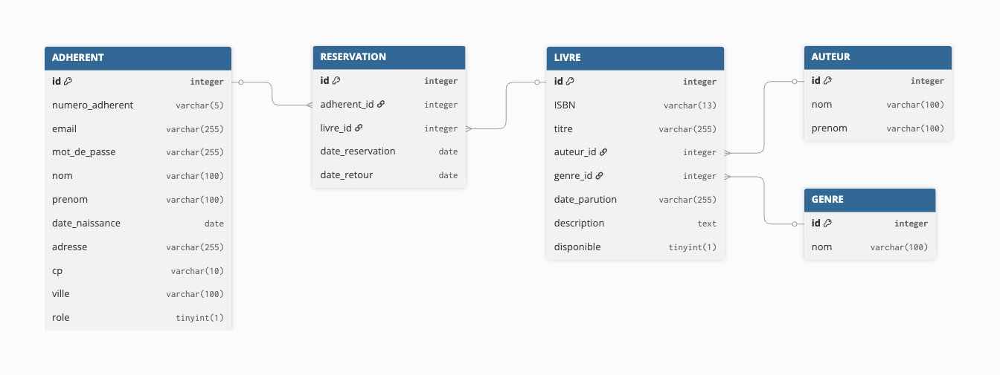

---

## 📸 Captures d’écran

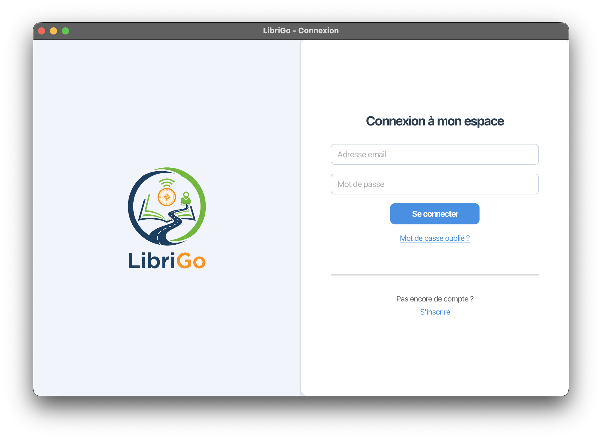

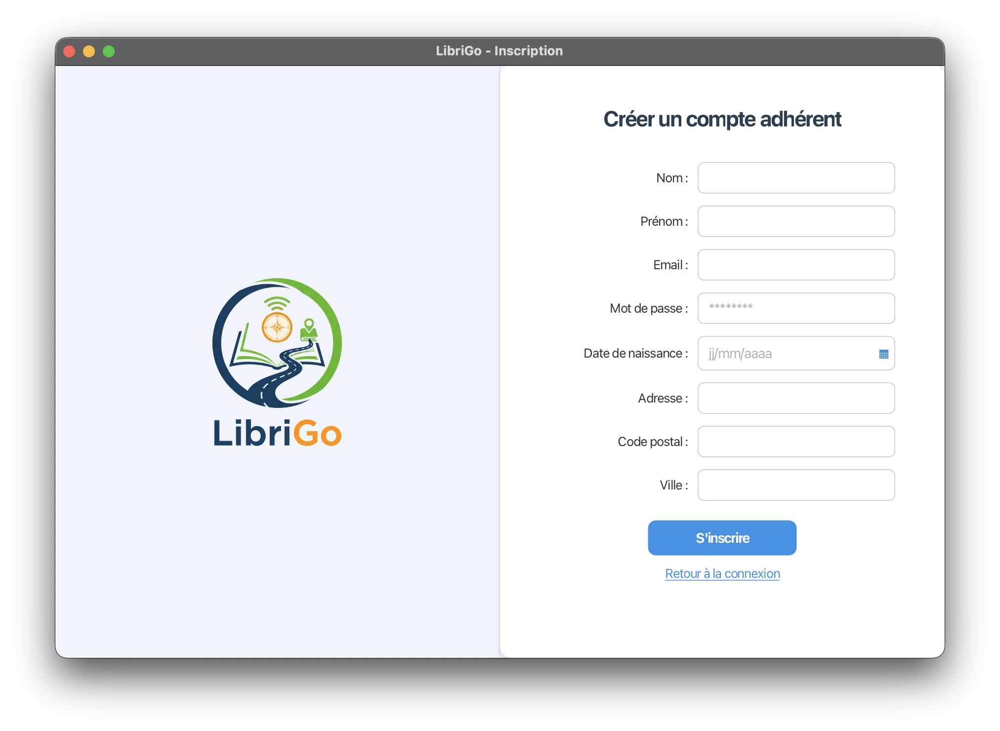

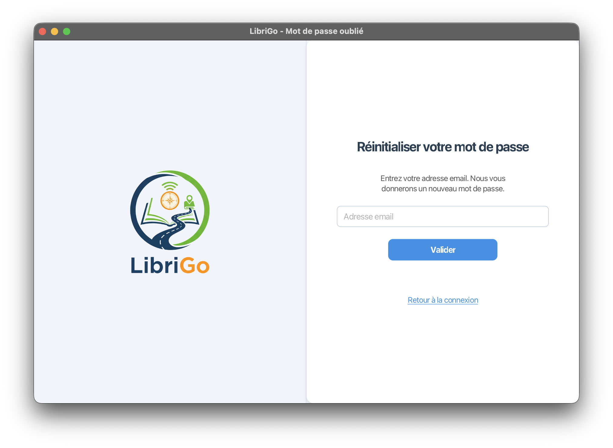

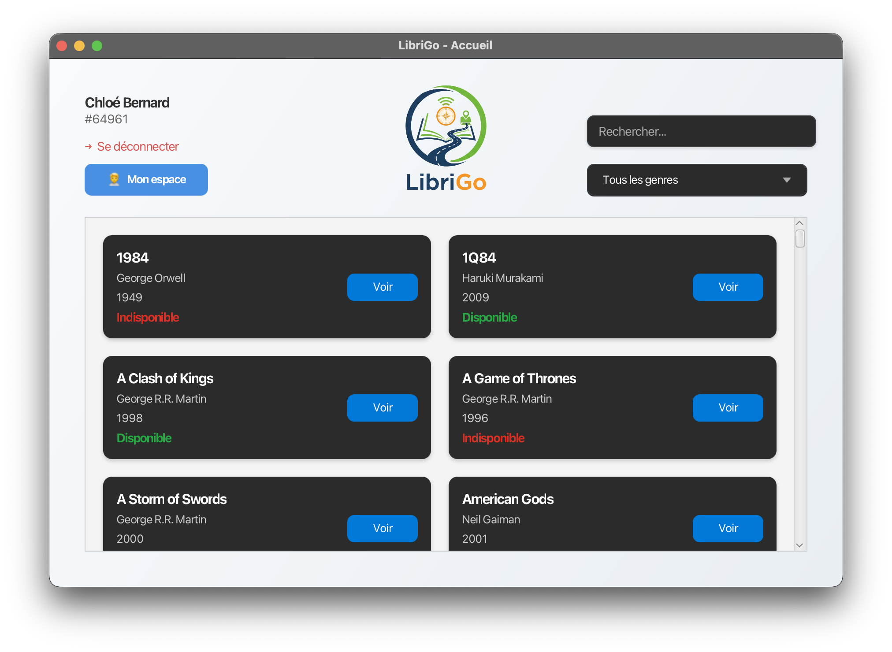

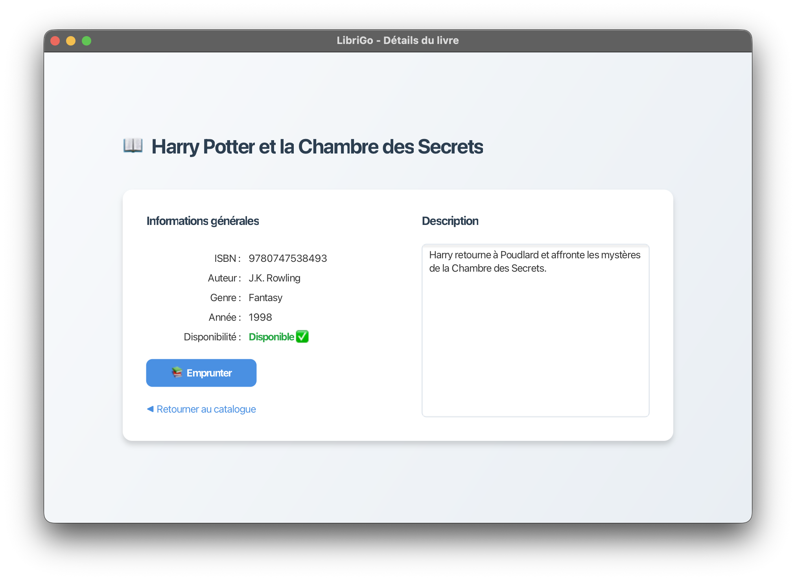

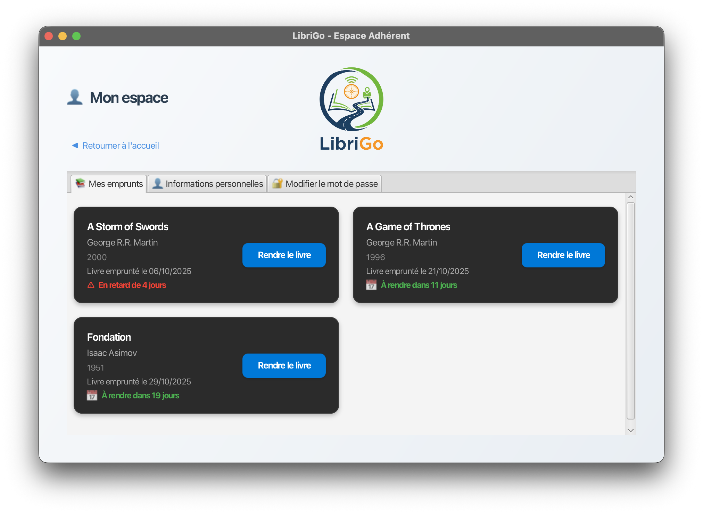

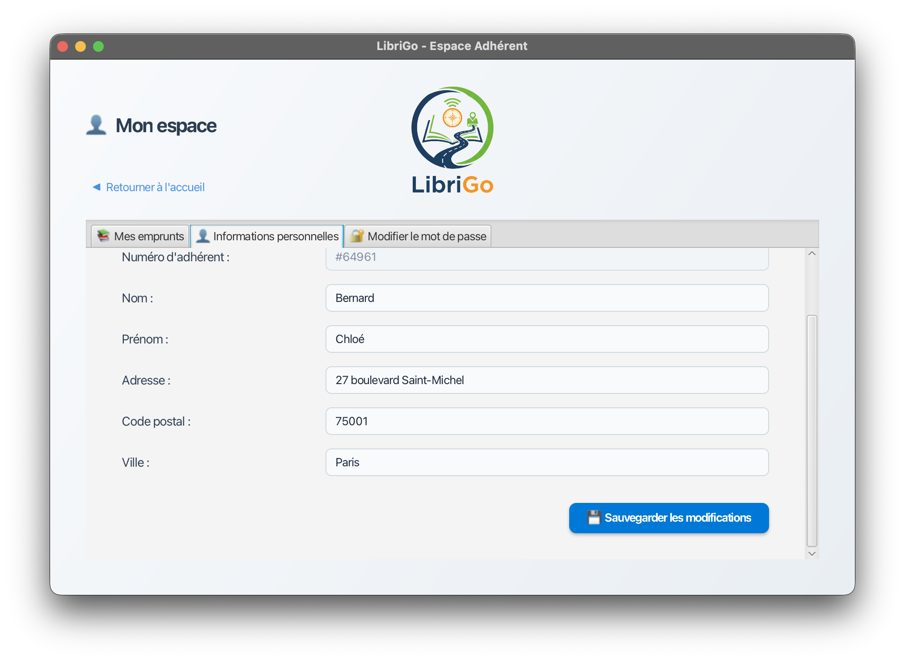

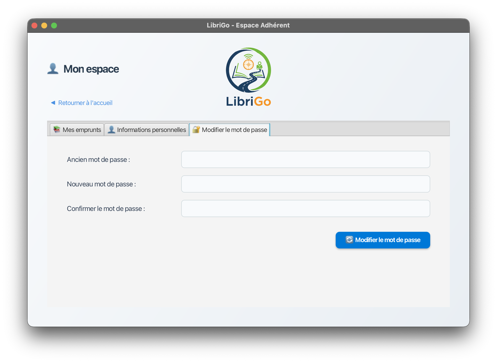

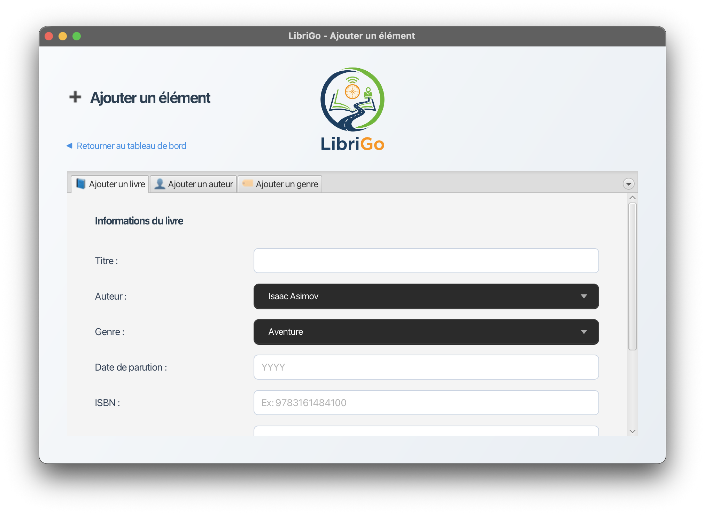

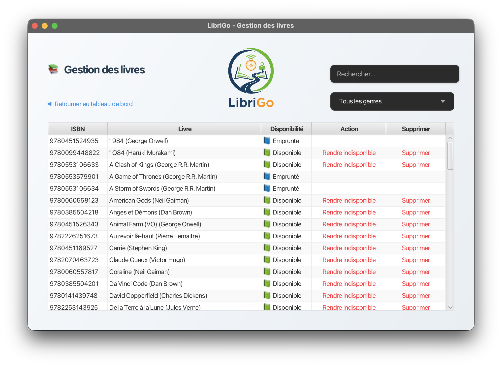

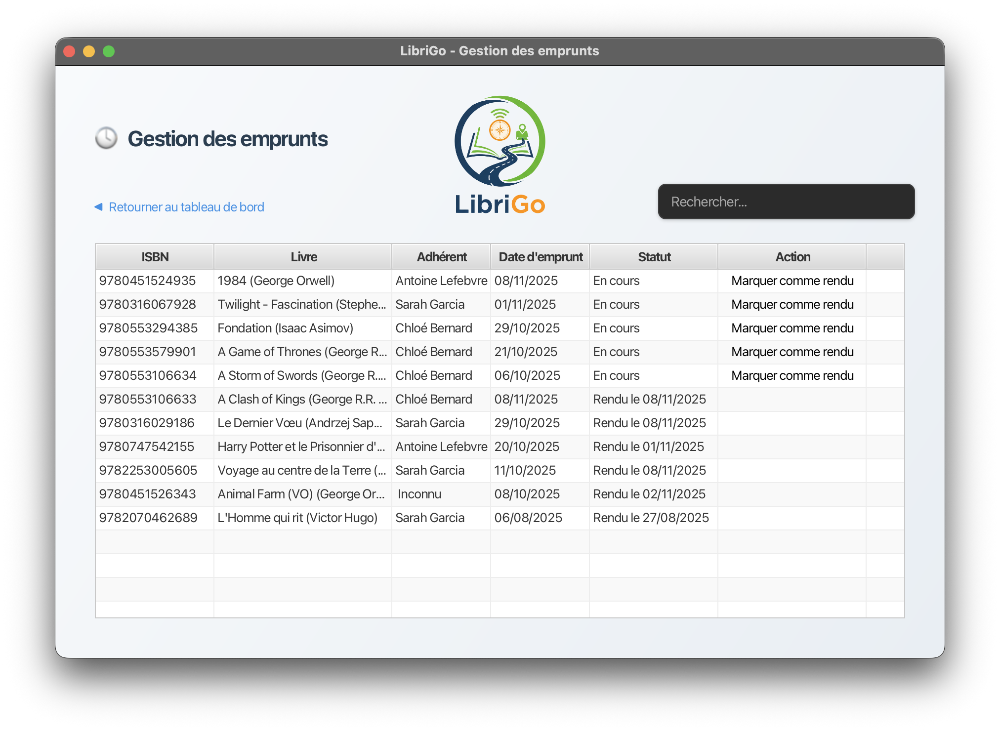

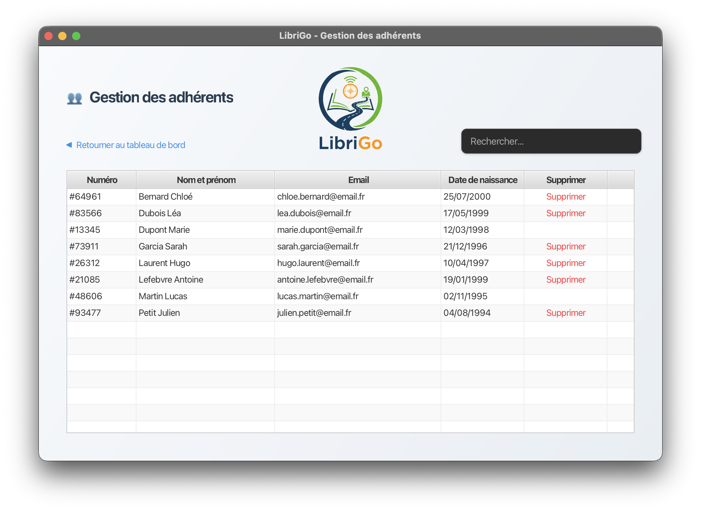